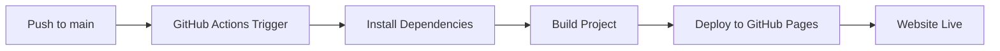

# Automation Setup Guide - Coltigent Website

This guide explains the automated deployment and local testing setup for the Coltigent website.

## 🎯 Overview

The website now has:
- ✅ **Local testing environment** with multiple testing options
- ✅ **Automated GitHub Actions** for deployment
- ✅ **Comprehensive testing scripts** and tools
- ✅ **Production-ready workflow**

## 🚀 Local Testing Setup

### Quick Start
```bash
# Start development server
npm start

# Or use the interactive script
./scripts/test-local.sh
```

### Testing Options

#### 1. **Interactive Testing Script** (Recommended)
```bash
./scripts/test-local.sh
```
This provides an interactive menu with options:
- Start development server
- Build for production
- Test production build locally
- Run tests
- Check for issues

#### 2. **Direct Commands**
```bash
# Development
./scripts/test-local.sh dev
npm start

# Production testing
./scripts/test-local.sh build
npm run build

# Test production build locally
./scripts/test-local.sh test-build
npm run test:build

# Run tests
./scripts/test-local.sh test
npm test

# Check for issues
./scripts/test-local.sh check
```

#### 3. **npm Scripts**
```bash
# Development
npm start              # Start development server
npm run dev           # Same as start

# Building & Testing
npm run build         # Build for production
npm run serve         # Serve production build locally
npm run test:build    # Build and serve locally

# Code Quality
npm run lint          # Check for linting issues
npm run lint:fix      # Fix linting issues
npm run format        # Format code

# Analysis
npm run analyze       # Analyze bundle size
npm run check-deps    # Check for unused dependencies
npm run security-audit # Check for security vulnerabilities
```

## 🤖 Automated Deployment

### GitHub Actions Workflows

#### 1. **Main Deployment Workflow** (`.github/workflows/deploy.yml`)
- **Triggers**: Push to `main` branch
- **Actions**:
  - Sets up Node.js environment
  - Installs dependencies
  - Builds the project
  - Deploys to GitHub Pages
- **Result**: Website automatically updates at `https://coltigent.github.io`

#### 2. **Testing Workflow** (`.github/workflows/test.yml`)
- **Triggers**: Pull requests to `main` branch
- **Actions**:
  - Runs tests
  - Builds the project
  - Checks build output
- **Result**: Ensures code quality before merging

### How Automated Deployment Works



### Manual Deployment
If you need to deploy manually:
```bash
npm run deploy
```

## 📋 Setup Instructions

### 1. **Initial Repository Setup**

1. **Create GitHub repository**
   ```bash
   # Create new repository on GitHub
   # Name: coltigent.github.io
   # Make it public
   ```

2. **Push your code**
   ```bash
   git init
   git add .
   git commit -m "Initial commit - Coltigent website"
   git branch -M main
   git remote add origin https://github.com/coltigent/coltigent.github.io.git
   git push -u origin main
   ```

3. **Enable GitHub Pages**
   - Go to repository Settings
   - Navigate to Pages section
   - Select "Deploy from a branch"
   - Choose "gh-pages" branch
   - Save

### 2. **Local Development Setup**

1. **Install dependencies**
   ```bash
   npm install
   ```

2. **Start development**
   ```bash
   npm start
   ```

3. **Test production build**
   ```bash
   npm run test:build
   ```

## 🔄 Development Workflow

### Daily Development Process

1. **Start development**
   ```bash
   npm start
   ```

2. **Make changes**
   - Edit files in `src/`
   - Browser automatically reloads
   - Test functionality

3. **Before committing**
   ```bash
   npm run lint
   npm run build
   npm test
   ```

4. **Commit and push**
   ```bash
   git add .
   git commit -m "Your commit message"
   git push origin main
   ```

5. **Automatic deployment**
   - GitHub Actions automatically builds and deploys
   - Website updates in 2-3 minutes

### Testing Checklist

Before pushing to GitHub:
- [ ] Code runs locally (`npm start`)
- [ ] Production build works (`npm run build`)
- [ ] No linting errors (`npm run lint`)
- [ ] Tests pass (`npm test`)
- [ ] All pages load correctly
- [ ] Forms work properly
- [ ] Responsive design works

## 🧪 Testing Commands Reference

### Development Testing
```bash
# Start development server
npm start
# or
./scripts/test-local.sh dev

# Test production build locally
npm run test:build
# or
./scripts/test-local.sh test-build
```

### Code Quality Testing
```bash
# Check for linting issues
npm run lint

# Fix linting issues automatically
npm run lint:fix

# Format code
npm run format

# Check for security vulnerabilities
npm run security-audit
```

### Performance Testing
```bash
# Analyze bundle size
npm run analyze

# Check for unused dependencies
npm run check-deps

# Build and check size
npm run build
```

## 🔧 Troubleshooting

### Common Issues

#### 1. **Port 3000 already in use**
```bash
# Kill the process
lsof -ti:3000 | xargs kill -9

# Or use different port
PORT=3001 npm start
```

#### 2. **Build fails**
```bash
# Clear cache and reinstall
rm -rf node_modules package-lock.json
npm install
npm run build
```

#### 3. **GitHub Actions fails**
- Check Actions tab in GitHub repository
- Look for specific error messages
- Ensure all dependencies are in `package.json`

#### 4. **Deployment not working**
- Verify GitHub Pages is enabled
- Check gh-pages branch exists
- Ensure repository is public

### Performance Issues

#### 1. **Slow development server**
```bash
# Use yarn instead
npm install -g yarn
yarn install
yarn start
```

#### 2. **Large bundle size**
```bash
# Analyze bundle
npm run analyze

# Look for large dependencies
npm run check-deps
```

## 📊 Monitoring

### Local Monitoring
```bash
# Check bundle size
npm run build
npm run analyze

# Monitor performance
npm run test:build
```

### Production Monitoring
- **GitHub Actions**: Check deployment status
- **GitHub Pages**: Monitor site availability
- **Google PageSpeed Insights**: Test performance
- **Browser DevTools**: Check for errors

## 🔒 Security

### Regular Security Checks
```bash
# Check for vulnerabilities
npm run security-audit

# Update dependencies
npm update

# Check outdated packages
npm outdated
```

### Best Practices
- Keep dependencies updated
- Don't commit sensitive data
- Use environment variables for secrets
- Regularly audit your code

## 📝 File Structure

```
coltigent.github.io/
├── .github/
│   └── workflows/
│       ├── deploy.yml      # Main deployment workflow
│       └── test.yml        # Testing workflow
├── scripts/
│   └── test-local.sh       # Local testing script
├── src/                    # Source code
├── public/                 # Public assets
├── package.json            # Dependencies and scripts
├── README.md              # Project documentation
├── DEVELOPMENT.md         # Development guide
├── DEPLOYMENT.md          # Deployment guide
└── AUTOMATION_SETUP.md    # This file
```

## 🎯 Next Steps

### Immediate Actions
1. **Test locally** - Run `npm start` and test all functionality
2. **Push to GitHub** - Deploy using automated workflow
3. **Verify deployment** - Check website at `https://coltigent.github.io`
4. **Set up monitoring** - Configure analytics and performance monitoring

### Future Enhancements
1. **Add tests** - Unit and integration tests
2. **Performance optimization** - Bundle splitting, lazy loading
3. **CI/CD improvements** - More comprehensive testing
4. **Monitoring** - Error tracking, performance monitoring

## 📞 Support

### Getting Help
1. Check this documentation
2. Look at `DEVELOPMENT.md` for detailed development guide
3. Check GitHub Issues
4. Review GitHub Actions logs

### Useful Resources
- **GitHub Actions**: Check Actions tab in repository
- **GitHub Pages**: Check Pages settings
- **React Documentation**: https://reactjs.org/
- **Bootstrap Documentation**: https://getbootstrap.com/

---

**Status**: ✅ Complete and Ready for Use
**Last Updated**: December 2024
